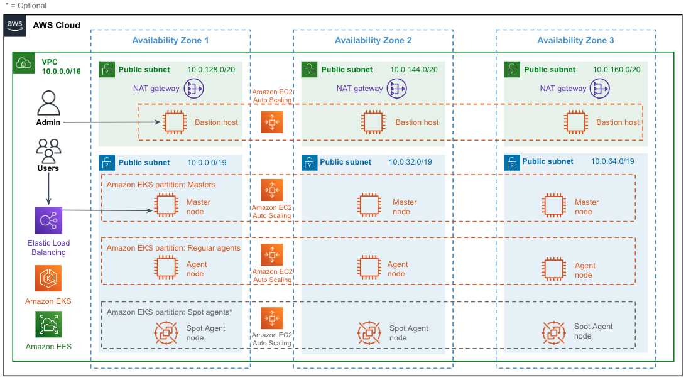

:xrefstyle: short

# Architecture

Deploying this {partner-product-name} for a new virtual private cloud (VPC) with default parameters builds the following CloudBees CI environment in the AWS Cloud.

The {partner-product-name} sets up the following resources by default:

* A highly available architecture that spans three Availability Zones.*
* A VPC configured with three public and three private subnets (one public and one 
private subnet in each Availability Zone).*
* In the public subnets:
** Managed NAT gateways to allow outbound internet access for resources in the private subnets.*
** A Linux bastion host in an Auto Scaling group, to allow inbound Secure Shell (SSH) access to the Amazon EKS nodes in the private subnets.*
* In the private subnets, the following Amazon EKS nodes in Auto Scaling groups consist of:
** Three CloudBees CI controller nodes.
** Three CloudBees CI regular agent nodes.
* https://helm.sh/[Helm^] and https://kubernetes.io/docs/reference/kubectl/overview/[kubectl^] installed and configured on the bastion host.
* CloudBees CI installed on Amazon EKS as a Kubernetes `StatefulSet`.
* An Amazon Elastic File System (Amazon EFS) file system and an https://docs.aws.amazon.com/eks/latest/userguide/efs-csi.html[EFS CSI Driver^] for 
Multi-AZ file storage. You can configure the {partner-product-name} to use Amazon Elastic Block 
Store (Amazon EBS) instead of Amazon EFS. For more information, see the **Data 
storage options** section.

NOTE: *The template that deploys the {partner-product-name} into an existing VPC skips the components marked by asterisks and prompts you for your existing VPC configuration.

## Helm
NOTE: In March 2020, the {partner-product-name} was updated to use https://helm.sh/[Helm^] as the means to install CloudBees CI into Amazon EKS. The use of Helm provides greater compatibility with AWS CloudFormation and reduced code maintenance. The manifests are now encapsulated by the CloudBees CI Helm chart, and the {partner-product-name} points to a version of the Helm chart, which is released by CloudBees.

The CloudBees CI Helm chart has a `values.yaml` file, which supports several configuration 
options (values). For example, the `OperationsCenter.HostName` value gives Operations Center a user-friendly Domain Name System (DNS) name, like `cloudbees-ci.example.com`, instead of using the default Load Balancer URL. Since everyone who uses this value has a different DNS name, it must be configurable using AWS CloudFormation. While it is possible to expose every Helm value as an AWS CloudFormation parameter, it would be difficult to maintain, so CloudBees contributed a new feature, the `CustomValueYaml` property, to the https://aws.amazon.com/quickstart/architecture/amazon-eks/[Amazon EKS Partner Solution framework^].

The Helm values found under `ValueYaml` in the https://github.com/aws-quickstart/quickstart-cloudbees-core/blob/master/templates/cloudbees-core-workload.template.yaml[workload template^] are internal Helm values. These are defaults that are safe to include in AWS CloudFormation templates because they apply to every installation and users don’t need to modify them. CloudBees added (in collaboration with AWS) the `CustomValueYaml` property. This property is exposed to end users as an AWS CloudFormation parameter, and it expects an Amazon S3 or HTTP URL that contains custom Helm values in the regular https://github.com/aws-quickstart/quickstart-cloudbees-core/blob/master/examples/customValues.yaml[`values.yaml`^] format. Custom Helm values are merged with internal Helm values during Helm operations such as `install` and `upgrade`, which are executed by AWS Lambda when the {partner-product-name} is installed or upgraded. The `CustomValueYaml` feature allows users to maintain Helm customizations
separate from the {partner-product-name} by using a single AWS CloudFormation parameter.

## Automatic Scaling
The {partner-product-name} places all Amazon EKS nodes in Auto Scaling groups, but it doesn’t install the Kubernetes Cluster Autoscaler by default. The https://github.com/kubernetes/autoscaler/tree/master/cluster-autoscaler[Cluster Autoscaler^] provides automatic scale-up and scale-down by allowing Kubernetes to modify the Amazon EC2 Auto Scaling groups. For example, scale-up occurs when a pod is launched but Kubernetes finds that there is insufficient CPU or memory to run the pod. You can install the Cluster Autoscaler 
manually after you deploy the {partner-product-name}. You can also scale your instances up and down manually by modifying the **Desired Capacity** and **Max** for each node group in the https://console.aws.amazon.com/ec2/[Amazon EC2 console^].

IMPORTANT: We strongly recommend running mission-critical workloads on the regular agents partition. Otherwise, please refer to the Overview section of this deployment guide to learn more about configuring a third partition for agents to run workloads on EC2 spot instances. #The following section only applies to an integration with EC2 spot instances.#

## Spot integration
The Spot agents partition uses an Auto Scaling group that allows multiple Amazon EC2 instance types to be launched into the same group. This makes it possible to create a diversified pool of Spot Instances without additional configuration. Due to limitations with the Cluster Autoscaler at the time of this writing, we recommend using Spot Instances of the same CPU and memory in the Spot partition. The default instance types are `m4.large`, `m5.large`, `m5a.large`, and `m5d.large`. Each instance type has 2 CPUs and 8 GiB of memory.
Agent pods that run on the Spot agents partition are terminated and disconnected from a Managed Controller when a Spot Instance is reclaimed; they are not recovered or restarted automatically.

Currently, Spot interruption events can be identified by the following:

* The agent appears offline in the user interface and is removed automatically thereafter.
* The build ends with a status of `ABORTED`.
* The build log contains the following messages:
** `Cannot contact agentName: java.lang.InterruptedException`
** `Agent agentName was deleted; canceling node body`
** `Could not connect to agentName to send interrupt signal to process`
** `Agent was removed`

If you experience different behavior, we recommend upgrading your `kubernetes` and `durable-task` plugins to the latest versions.

## Agent segregation
CloudBees CI uses the https://wiki.jenkins.io/display/JENKINS/Kubernetes+Plugin[Kubernetes plugin^] to launch agent pods that process CI/CD workloads, such as building, testing, and deploying an application. Due to the spiky and resource-intensive nature of agents, controllers and Agents should be scaled independently of each other.
The {partner-product-name} achieves independent scaling with a combination of Auto Scaling groups and Kubernetes https://kubernetes.io/docs/concepts/overview/working-with-objects/labels/[labels^] and https://kubernetes.io/docs/concepts/configuration/taint-and-toleration/[taints^]. The use of Auto Scaling groups was covered earlier in this guide. Labels are used to identify each Kubernetes node. For example, each controller node is labeled with `partition=masters`. Taints are used for anti-affinity and are applied only to the agent pools. When a Managed Controller is launched with default settings in Operations Center, the Managed Controller is always scheduled onto a controller node, where there are no taints. Agent pods run in the master node pool by default, but can run on the regular agents node pool via configuration settings, as covered in the **Targeting agent pools from a pipeline section**.

